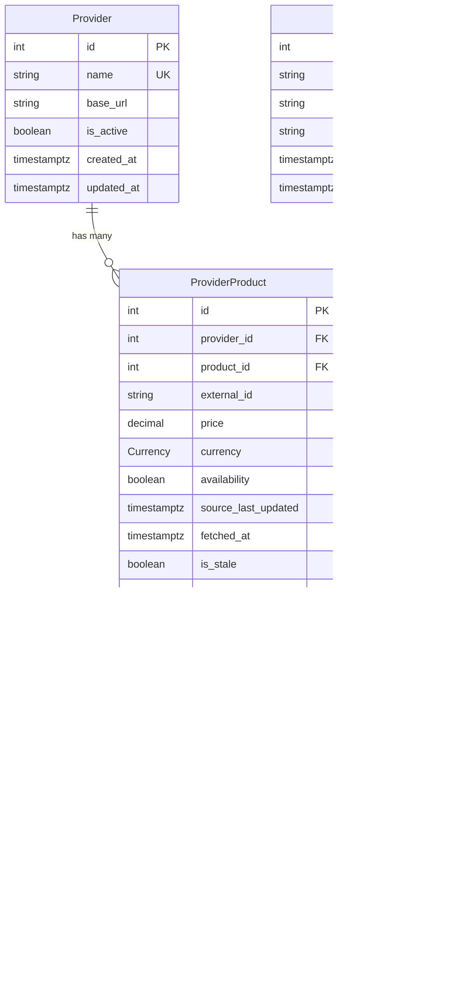

# Product Price Aggregator

A backend service that aggregates pricing and availability data for digital products from multiple third-party providers. Built with NestJS, Prisma, and PostgreSQL.

The service collects data in real-time from external APIs, normalizes it, stores it efficiently, and exposes REST endpoints to query the aggregated data.

## Tech Stack

- **Framework**: NestJS (TypeScript)
- **ORM**: Prisma
- **Database**: PostgreSQL
- **Containerization**: Docker + Docker Compose

## Getting Started

### Prerequisites

- Node.js 20+
- Yarn
- Docker & Docker Compose (for PostgreSQL)

### Setup (Local App + Dockerized PostgreSQL)

1. Clone the repo and install dependencies:

```bash
yarn install
```

2. Copy the environment file and adjust if needed:

```bash
cp .env.example .env
```

3. Start only PostgreSQL in Docker:

```bash
docker compose up -d db
```

4. Run Prisma migrations to set up the database:

```bash
yarn prisma:migrate
```

5. Run the app in development mode:

```bash
yarn start:dev
```

The app will be running on `http://localhost:3398`.

### Setup (Full Docker Compose Stack)

If you want to run both PostgreSQL and the Nest app in containers instead of running the app locally:

```bash
yarn docker:up
```

Migrations run automatically on container start, so the database is ready to go.

The app will be available on `http://localhost:3398`.

If you add or remove dependencies, rebuild the app image before starting the stack again:

```bash
docker compose --profile dev up -d --build
```

There is also a production profile that uses a multi-stage Dockerfile with a smaller image, non-root user, and `dumb-init` for proper signal handling:

```bash
yarn docker:prod:up
```

### Tests

Run the unit tests:

```bash
yarn test
```

Run the HTTP integration tests for the product endpoints:

```bash
yarn test:e2e
```

### Docker and Prisma Scripts

| Script                      | What it does                            |
| --------------------------- | --------------------------------------- |
| `yarn docker:up`            | Start dev containers (db + app)         |
| `yarn docker:down`          | Stop and remove dev containers          |
| `yarn docker:logs`          | Follow dev app container logs           |
| `yarn docker:build`         | Build dev containers                    |
| `yarn docker:restart`       | Restart dev app container               |
| `yarn docker:no-cache`      | Rebuild dev containers without cache    |
| `yarn docker:prod:up`       | Start production containers (db + app)  |
| `yarn docker:prod:down`     | Stop and remove production containers   |
| `yarn docker:prod:logs`     | Follow production app container logs    |
| `yarn docker:prod:build`    | Build production containers             |
| `yarn docker:prod:no-cache` | Rebuild production containers, no cache |
| `yarn prisma:migrate`       | Run Prisma migrations                   |
| `yarn prisma:generate`      | Regenerate Prisma Client                |
| `yarn prisma:studio`        | Open Prisma Studio (DB browser)         |

## Directory Structure

```
src/
├── config/                          # Zod env schema and config exports
├── core/                            # Shared building blocks used across all modules
│   ├── constants/                   # App-wide constants (API key header, etc.)
│   ├── decorators/                  # Custom decorators (@Public, @SwaggerApiPaginatedQuery)
│   ├── dtos/                        # Base DTOs (PaginationQueryDto, PageMetaDto)
│   ├── enums/                       # Shared enums (NodeEnvironment, etc.)
│   ├── factories/                   # ResponseFactory for consistent API responses
│   ├── filters/                     # Global HttpExceptionFilter
│   ├── guards/                      # ApiKeyGuard
│   ├── interceptors/                # Request logging interceptor
│   ├── interfaces/                  # Shared type definitions
│   └── swagger/                     # Reusable Swagger schema helpers
├── module-options/                  # NestJS module configuration factories
├── modules/
│   ├── aggregation/                 # Aggregation engine (scheduler, persistence, events)
│   │   ├── constants/
│   │   ├── events/
│   │   ├── interfaces/
│   │   └── services/
│   ├── database/                    # PrismaService and DB constants
│   ├── health/                      # Health check endpoint
│   ├── product-stream/              # SSE event bridge (listens to aggregation events)
│   ├── products/                    # Products REST API (list, detail, changes)
│   │   ├── dto/
│   │   │   ├── request/
│   │   │   └── response/
│   │   └── interfaces/
│   ├── providers/                   # Provider adapters and HTTP client factory
│   │   ├── adapters/                # Per-provider normalization (A, B, C)
│   │   ├── constants/
│   │   └── interfaces/
│   ├── shared/                      # SharedModule (HttpClientFactory with retry/backoff)
│   ├── simulated-providers/         # Fake upstream APIs for local development
│   │   ├── controllers/
│   │   ├── data/
│   │   ├── dto/
│   │   └── services/
│   └── streams/                     # SSE controller and HTML viewer
├── app.module.ts
├── bootstrap.ts                     # Swagger, pipes, prefix — reused in e2e tests
└── main.ts

test/
├── helpers/                         # Prisma mock helpers and test factories
└── products.e2e-spec.ts             # Integration tests for product endpoints

prisma/
├── migrations/
└── schema.prisma
```

## Conventions

### File and Directory Naming

- **Files**: kebab-case with type suffix — `aggregation-persistence.service.ts`, `get-products-query.dto.ts`, `api-key.guard.ts`
- **Classes**: PascalCase — `AggregationPersistenceService`, `GetProductsQueryDto`, `ApiKeyGuard`
- **Constants**: UPPER_SNAKE_CASE — `API_KEY_HEADER`, `TRANSACTION_TIMEOUT_MS`
- **Barrel exports**: Each subdirectory has an `index.ts` that re-exports its contents. Module root directories (`products/`, `aggregation/`) and `src/` itself do not get barrel files.

### Module Organization

Each feature module lives under `src/modules/<feature>/` and follows a consistent layout:

- `<feature>.module.ts` — NestJS module definition
- `<feature>.controller.ts` — route handlers (if the module exposes HTTP endpoints)
- `services/` — business logic
- `dto/request/` and `dto/response/` — input validation and output shaping
- `interfaces/` — TypeScript types scoped to the module
- `constants/` — module-specific constants

### Routing

All controllers are prefixed with `api/v1` globally in `bootstrap.ts`. Controller-level decorators only specify the resource name (e.g. `@Controller('products')`), so the full path becomes `api/v1/products`.

### Response Format

All API responses go through `ResponseFactory`:

- `ResponseFactory.data(item)` — single item: `{ data: T }`
- `ResponseFactory.dataArray(items)` — list: `{ data: T[] }`
- `ResponseFactory.dataPage(items, meta)` — paginated: `{ data: T[], meta: { page, limit, total, totalPages } }`

### Error Responses

A global `HttpExceptionFilter` normalizes every error into one shape:

```json
{
  "statusCode": 400,
  "message": "Validation failed",
  "error": "Bad Request",
  "timestamp": "2026-03-04T10:00:00.000Z"
}
```

Validation errors keep their message arrays intact so clients can render field-level feedback.

### Path Aliases

TypeScript path aliases are configured in `tsconfig.json` and used everywhere instead of relative imports:

| Alias             | Maps to              |
| ----------------- | -------------------- |
| `@/*`             | `src/*`              |
| `@core/*`         | `src/core/*`         |
| `@modules/*`      | `src/modules/*`      |
| `@config`         | `src/config`         |
| `@module-options` | `src/module-options` |
| `@test/*`         | `test/*`             |

### Testing

- **Unit tests**: colocated with source files as `*.spec.ts`
- **Integration tests**: in `test/` as `*.e2e-spec.ts`, using the same bootstrap setup as the real app
- **Test helpers**: shared mocks and factories live in `test/helpers/`

### Guards and Security

- `@Public()` decorator opts endpoints out of API key validation
- Guard execution order: API key guard runs before rate limiter, so unauthorized requests are rejected without consuming rate-limit budget

## Environment Variables

Check `.env.example` for all available variables with their defaults. The app validates everything on startup using Zod, so it will fail fast if something is missing or wrong.

## API Documentation

Swagger UI is available at `http://localhost:3398/api/docs` once the app is running. You can explore and test all the endpoints from there.

The docs page itself loads without authentication, but "Try it out" calls require a valid `x-api-key` header. Click the **Authorize** button in Swagger UI and enter your `API_KEY` value to unlock the protected endpoints.

## Realtime Viewer

There is also a minimal SSE viewer at `http://localhost:3398/api/v1/streams/viewer`.

- The SSE stream endpoint is `GET /api/v1/streams/products`
- This stream is public for now by decision
- The stream emits `product-change` events when price or availability changes, plus a heartbeat event every 30 seconds to keep the connection alive

## Database Schema



- **Provider** — external data source (e.g. Provider A, B, C). Holds the base URL and active status.
- **Product** — canonical product identified by a unique `canonical_key`. Multiple providers can offer the same product.
- **ProviderProduct** — a specific provider's current offer for a product (price, availability, currency). This is where we track freshness via `fetched_at` and `is_stale`.
- **ProviderProductHistory** — snapshot of every price/availability change. Stores both old and new values with a `change_type` enum (`INITIAL`, `PRICE_CHANGE`, `AVAILABILITY_CHANGE`, `BOTH`).

## Design Decisions

- **Zod for env validation**: I prefer Zod over Joi because it gives better TypeScript inference out of the box. The ConfigService is fully typed so you get autocomplete on `config.get('VARIABLE_NAME')`.
- **Docker Compose**: PostgreSQL runs in a container to keep the local setup simple. For local development, I start only `db` with Docker and run the Nest app locally. There is also a full-container workflow via `yarn docker:up` when you want both `db` and `app` in Docker.
- **Bootstrap separation**: The bootstrap logic (Swagger, pipes, etc.) is in a separate file from `main.ts`. This makes it easier to reuse the same setup in e2e tests without duplicating code.
- **Global ValidationPipe**: Registered as `APP_PIPE` automatically validate and sanitize all incoming requests.
- **Global exception filter**: All HTTP errors now use one response shape with `statusCode`, `message`, `error`, and `timestamp`. Validation errors keep their message arrays untouched so clients can render them cleanly.
- **Request logging interceptor**: Every request logs method, path, status, and duration. Failures also log internal error details without leaking stack traces to API responses.
- **API key guard**: Product endpoints require `x-api-key`, and startup config requires `API_KEY` to be present. Simulated provider endpoints are explicitly public.
- **Guard ordering**: The API key guard runs before the throttler guard on purpose. Unauthorized requests get rejected immediately without consuming rate-limit budget, so a bad actor spamming invalid keys cannot exhaust the rate limit for legitimate clients.
- **Rate limiting**: The app applies three in-memory global limits by default: 10 requests per second, 100 requests per minute, and 1000 requests per hour. All values are configurable via environment variables (see `.env.example`). Simulated provider endpoints are excluded so scheduled aggregation calls and manual upstream checks do not get throttled.
- **Canonical Product model**: The data model separates `Product` (canonical) from `ProviderProduct` (provider-specific). This way we can aggregate the same product across multiple providers and track each provider's price/availability independently. Each product gets a `canonicalKey` (slugified name) that links the same product across providers. Since we control the simulated providers, we make sure they use consistent product names so the keys match. In production, this would need something more advanced like fuzzy matching or a manual mapping table to handle cases where providers name the same product differently (e.g. "Adobe Photoshop License" vs "Photoshop License").
- **Provider adapter normalization**: Each provider still owns payload mapping into one normalized contract, but the transport logic now lives in a shared resilient HTTP client. Adapters create a provider-specific client from `HttpClientFactory` and only handle normalization. Prices are normalized as fixed 2-decimal strings (not floats) to avoid precision issues when comparing against Prisma's `Decimal(12,2)` and to prevent false-positive change detection in price history. Currency codes are always uppercased to avoid duplicates like `"usd"` vs `"USD"`. Timestamps from providers are parsed safely with a null fallback so a bad timestamp from one provider doesn't crash the entire fetch cycle.
- **Shared HTTP resilience**: The `SharedModule` (not global — imported explicitly where needed) provides an `HttpClientFactory` that creates configured `HttpClient` instances per provider. Each client wraps `fetch` with timeout via `AbortController`, retries on transient failures (5xx, 429, 408, timeouts, connection errors), and exponential backoff with jitter to prevent thundering herd. Adapters create their client once in the constructor and only handle normalization.
- **Canonical key via slugify**: The `canonicalKey` is derived by slugifying the product name (e.g. "NestJS Masterclass" becomes "nestjs-masterclass"). This is a deliberate simplification for this assignment since we control the simulated providers and their naming is consistent. In a real-world scenario, different providers could name the same product differently (e.g. "Adobe Photoshop" vs "Photoshop License"), and you would need a mapping table or fuzzy matching strategy instead of simple slugification.
- **Staleness via fetchedAt**: Instead of relying on provider timestamps, we track when we last fetched each record (`fetchedAt`). If it's been too long since the last successful fetch, we mark the data as stale. This is more reliable because we control the clock.
- **Aggregation engine**: The aggregation module fetches every provider concurrently with `Promise.allSettled`, so one upstream failure never blocks the rest of the cycle. Persistence stays sequential on purpose because multiple normalized items can share the same provider or canonical product, and sequential upserts avoid unnecessary races on unique keys while keeping the implementation simple for this assignment.
- **Overlap-safe scheduler**: The aggregation cycle starts immediately on boot, then repeats on a configurable interval. A simple in-memory mutex prevents overlapping cycles if one run takes longer than the interval. This keeps the behavior deterministic without adding queueing complexity the assignment does not ask for.
- **History tracking**: We only create `ProviderProductHistory` rows when price or availability actually changes. The history insert and current-state update happen inside the same Prisma transaction so we do not end up with partial state if a write fails in the middle.
- **Post-commit SSE emission**: Realtime change events are emitted only after the persistence transaction commits successfully. This avoids broadcasting a change that later rolls back in the database.
- **Products API filtering**: On `GET /products`, the `name` filter applies to the canonical product, while `provider`, `availability`, `minPrice`, `maxPrice`, and `stale` apply to offers. A product is returned only when at least one offer matches, and the response includes only the matching offers. This keeps the API behavior predictable and avoids returning unrelated offers after filtering.
- **Detail vs listing behavior**: The list endpoint is intentionally selective, but `GET /products/:id` is intentionally complete. It returns all offers for that product, including stale ones, so clients can decide how to present them. To keep the payload under control, each offer includes only the latest 20 history entries.
- **Product upsert — first provider wins**: When upserting the canonical `Product`, we only set `name` and `description` on the initial insert. Subsequent providers with the same `canonicalKey` do not overwrite these fields. This avoids the "last writer wins" problem where the canonical product's metadata would change arbitrarily depending on which provider happened to be processed last. In a production system you might want a preferred-provider strategy or a manual curation step.
- **Decimal for price comparison**: Prisma stores prices as `Decimal(12,2)` and returns them as `Decimal` objects. We use the `Decimal` class from `@prisma/client/runtime/client` and its `.equals()` method for exact comparison when detecting price changes, instead of converting to JavaScript `number` which would introduce floating-point precision issues and could cause false change detections.
- **Decimal serialization in responses**: Prisma `Decimal` values are converted to JavaScript `number` using `.toNumber()` in response DTOs. This is safe for our `Decimal(12,2)` currency values since they fit well within JavaScript's safe integer/float range. For higher precision use cases (e.g. crypto), you would serialize as string instead.
- **History cap on detail endpoint**: `GET /products/:id` returns only the latest 20 history entries per offer instead of paginating them. This keeps the payload small without adding the complexity of nested pagination. For most use cases, the recent history is what matters.
- **Changes endpoint excludes INITIAL**: `GET /products/changes` only returns actual changes (price, availability, or both). The `INITIAL` change type (first time a product is seen) is excluded since it is not a real change from the consumer's perspective.
- **No offer cap on listing**: `GET /products` does not limit the number of offers per product. With only three simulated providers this is not an issue. In production with many providers, you would add a `take` limit on the offers query.

## Future Improvements

Things I would add in a production version of this service but skipped here to keep scope realistic for the assignment:

- **Stricter authentication and authorization**: The current `x-api-key` guard is intentionally minimal for this assignment. In production I would replace or complement it with a stronger scheme such as signed service-to-service tokens, scoped API keys with rotation/expiry, or JWT/OAuth2 depending on the consumer model.
- **Job queue for aggregation**: The current scheduler uses a simple `setInterval` with an in-memory mutex. In production I would replace this with BullMQ backed by Redis, so aggregation jobs survive restarts, can be retried independently per provider, and scale horizontally across multiple workers. Each provider fetch would be its own job, with dead-letter queues for repeated failures.
- **Caching layer**: There is no caching right now — every API request hits the database directly. Adding a Redis cache (or even NestJS `CacheModule` with an in-memory store) for the product listing and detail endpoints would reduce database load significantly, especially for read-heavy consumers. Cache invalidation would be straightforward since we already emit change events after persistence.
- **History table partitioning and archival**: The `provider_product_history` table grows indefinitely. In production, I would partition it by time (e.g. monthly ranges using PostgreSQL native partitioning) and archive old partitions to cold storage. This keeps query performance stable as the table grows and reduces storage costs.
- **BigInt primary keys**: All tables currently use 32-bit `Int` primary keys. For a high-volume history table, migrating to `BigInt` would prevent eventual ID exhaustion. Skipped for now since the data volume in this assignment is small.
- **Cursor-based pagination for changes**: The `/products/changes` endpoint uses offset pagination, which degrades on large append-only tables. Cursor-based pagination (using `id` as cursor) would give consistent performance regardless of page depth. Not implemented yet since the current data volume does not warrant it.
- **Observability**: No metrics or tracing beyond request logging. Adding Prometheus metrics (aggregation cycle duration, provider latency histograms, error rates) and OpenTelemetry tracing would make the service production-observable. The SSE event count and database transaction times are also worth tracking.
