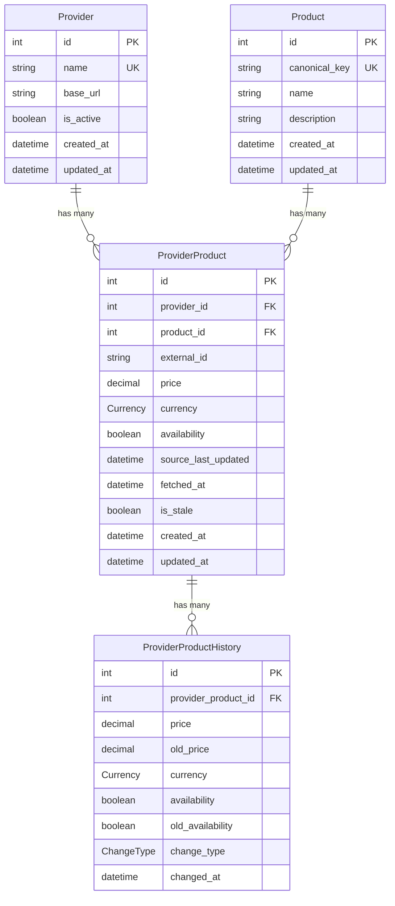

# Product Price Aggregator

A backend service that aggregates pricing and availability data for digital products from multiple third-party providers. Built with NestJS, Prisma, and PostgreSQL.

The service collects data in real-time from external APIs, normalizes it, stores it efficiently, and exposes REST endpoints to query the aggregated data.

## Tech Stack

- **Framework**: NestJS (TypeScript)
- **ORM**: Prisma
- **Database**: PostgreSQL
- **Containerization**: Docker + Docker Compose

## Getting Started

### Prerequisites

- Node.js 20+
- Yarn
- Docker & Docker Compose (for PostgreSQL)

### Setup

1. Clone the repo and install dependencies:

```bash
yarn install
```

2. Copy the environment file and adjust if needed:

```bash
cp .env.example .env
```

3. Start PostgreSQL with Docker:

```bash
yarn docker:up
```

4. Run Prisma migrations to set up the database:

```bash
yarn prisma:migrate
```

5. Run the app in development mode:

```bash
yarn start:dev
```

The app will be running on `http://localhost:3398`.

### Docker Scripts

| Script                 | What it does                       |
| ---------------------- | ---------------------------------- |
| `yarn docker:up`       | Start all containers in background |
| `yarn docker:down`     | Stop and remove containers         |
| `yarn docker:logs`     | Follow app container logs          |
| `yarn docker:build`    | Build containers                   |
| `yarn docker:restart`  | Restart app container              |
| `yarn docker:no-cache` | Rebuild containers without cache   |
| `yarn prisma:migrate`  | Run Prisma migrations              |
| `yarn prisma:generate` | Regenerate Prisma Client           |
| `yarn prisma:studio`   | Open Prisma Studio (DB browser)    |

## Environment Variables

Check `.env.example` for all available variables with their defaults. The app validates everything on startup using Zod, so it will fail fast if something is missing or wrong.

## API Documentation

Swagger UI is available at `http://localhost:3398/api/docs` once the app is running. You can explore and test all the endpoints from there.

## Database Schema



- **Provider** — external data source (e.g. Provider A, B, C). Holds the base URL and active status.
- **Product** — canonical product identified by a unique `canonical_key`. Multiple providers can offer the same product.
- **ProviderProduct** — a specific provider's current offer for a product (price, availability, currency). This is where we track freshness via `fetched_at` and `is_stale`.
- **ProviderProductHistory** — snapshot of every price/availability change. Stores both old and new values with a `change_type` enum (`INITIAL`, `PRICE_CHANGE`, `AVAILABILITY_CHANGE`, `BOTH`).

## Design Decisions

- **Zod for env validation**: I prefer Zod over Joi because it gives better TypeScript inference out of the box. The ConfigService is fully typed so you get autocomplete on `config.get('VARIABLE_NAME')`.
- **Docker Compose**: PostgreSQL runs in a container to keep the local setup simple. The app can run either locally or in a container too.
- **Bootstrap separation**: The bootstrap logic (Swagger, pipes, etc.) is in a separate file from `main.ts`. This makes it easier to reuse the same setup in e2e tests without duplicating code.
- **Global ValidationPipe**: Registered as `APP_PIPE` automatically validate and sanitize all incoming requests.
- **Canonical Product model**: The data model separates `Product` (canonical) from `ProviderProduct` (provider-specific). This way we can aggregate the same product across multiple providers and track each provider's price/availability independently. Each product gets a `canonicalKey` (slugified name) that links the same product across providers. Since we control the simulated providers, we make sure they use consistent product names so the keys match. In production, this would need something more advanced like fuzzy matching or a manual mapping table to handle cases where providers name the same product differently (e.g. "Adobe Photoshop License" vs "Photoshop License").
- **Provider adapter normalization**: Each provider still owns payload mapping into one normalized contract, but the transport logic now lives in a shared resilient HTTP client. Adapters create a provider-specific client from `HttpClientFactory` and only handle normalization. Prices are normalized as fixed 2-decimal strings (not floats) to avoid precision issues when comparing against Prisma's `Decimal(12,2)` and to prevent false-positive change detection in price history. Currency codes are always uppercased to avoid duplicates like `"usd"` vs `"USD"`. Timestamps from providers are parsed safely with a null fallback so a bad timestamp from one provider doesn't crash the entire fetch cycle.
- **Shared HTTP resilience**: The `SharedModule` (not global — imported explicitly where needed) provides an `HttpClientFactory` that creates configured `HttpClient` instances per provider. Each client wraps `fetch` with timeout via `AbortController`, retries on transient failures (5xx, 429, 408, timeouts, connection errors), and exponential backoff with jitter to prevent thundering herd. Adapters create their client once in the constructor and only handle normalization.
- **Canonical key via slugify**: The `canonicalKey` is derived by slugifying the product name (e.g. "NestJS Masterclass" becomes "nestjs-masterclass"). This is a deliberate simplification for this assignment since we control the simulated providers and their naming is consistent. In a real-world scenario, different providers could name the same product differently (e.g. "Adobe Photoshop" vs "Photoshop License"), and you would need a mapping table or fuzzy matching strategy instead of simple slugification.
- **Staleness via fetchedAt**: Instead of relying on provider timestamps, we track when we last fetched each record (`fetchedAt`). If it's been too long since the last successful fetch, we mark the data as stale. This is more reliable because we control the clock.
- **Aggregation engine**: The aggregation module fetches every provider concurrently with `Promise.allSettled`, so one upstream failure never blocks the rest of the cycle. Persistence stays sequential on purpose because multiple normalized items can share the same provider or canonical product, and sequential upserts avoid unnecessary races on unique keys while keeping the implementation simple for this assignment.
- **Overlap-safe scheduler**: The aggregation cycle starts immediately on boot, then repeats on a configurable interval. A simple in-memory mutex prevents overlapping cycles if one run takes longer than the interval. This keeps the behavior deterministic without adding queueing complexity the assignment does not ask for.
- **History tracking**: We only create `ProviderProductHistory` rows when price or availability actually changes. The history insert and current-state update happen inside the same Prisma transaction so we do not end up with partial state if a write fails in the middle.
- **Product upsert — first provider wins**: When upserting the canonical `Product`, we only set `name` and `description` on the initial insert. Subsequent providers with the same `canonicalKey` do not overwrite these fields. This avoids the "last writer wins" problem where the canonical product's metadata would change arbitrarily depending on which provider happened to be processed last. In a production system you might want a preferred-provider strategy or a manual curation step.
- **Decimal for price comparison**: Prisma stores prices as `Decimal(12,2)` and returns them as `Decimal` objects. We use the `Decimal` class from `@prisma/client/runtime/client` and its `.equals()` method for exact comparison when detecting price changes, instead of converting to JavaScript `number` which would introduce floating-point precision issues and could cause false change detections.
